# 🧾 Sistema ERP - Full Stack

Sistema ERP básico desarrollado con:

- ⚙️ Backend: ASP.NET Core + Entity Framework
- 💻 Frontend: React + Bootstrap
- 🔐 Autenticación JWT
- 📊 Dashboard con métricas
- 🌙 Modo oscuro
- 🎨 UI moderna con animaciones

---

## 🚀 Funcionalidades

- Login con autenticación
- CRUD de productos
- Registro de ventas
- Actualización automática de stock
- Dashboard con estadísticas

---

## 🧠 Tecnologías

- C#
- ASP.NET Core
- SQL Server
- React
- JavaScript
- Bootstrap
- Framer Motion

---

## 📸 Capturas

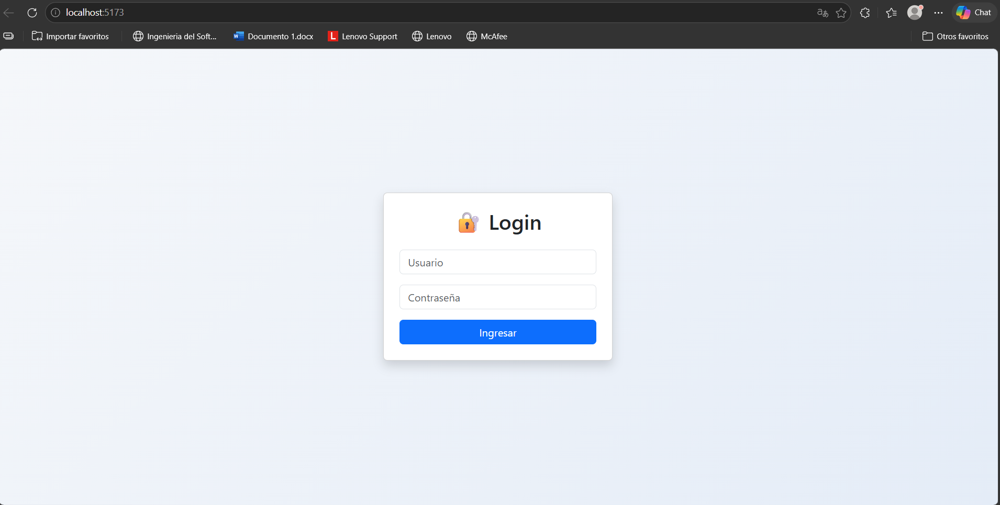
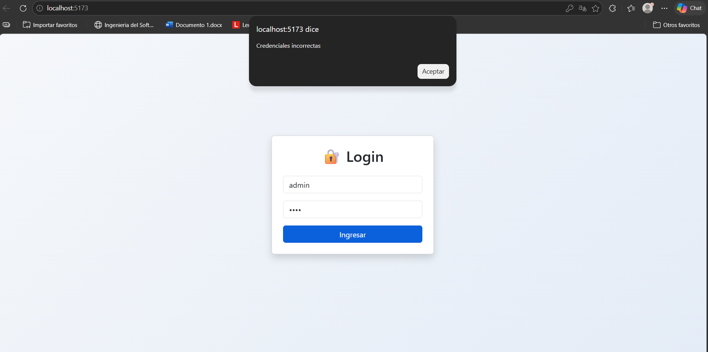
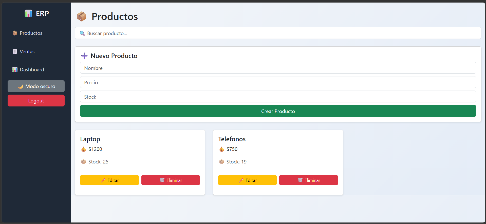
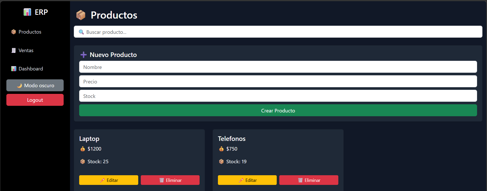
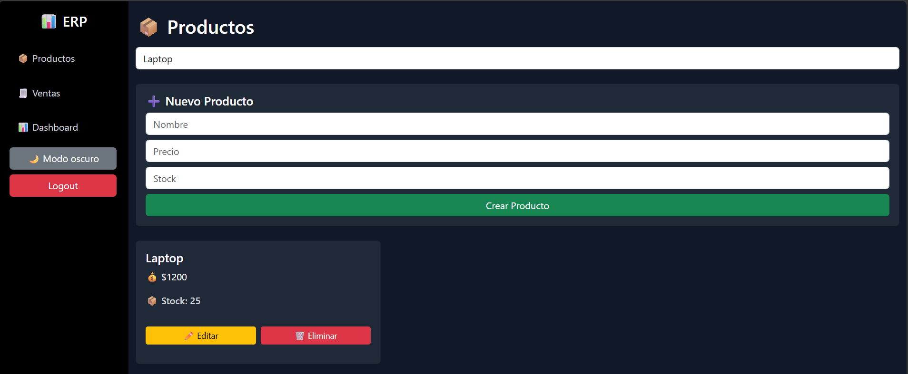
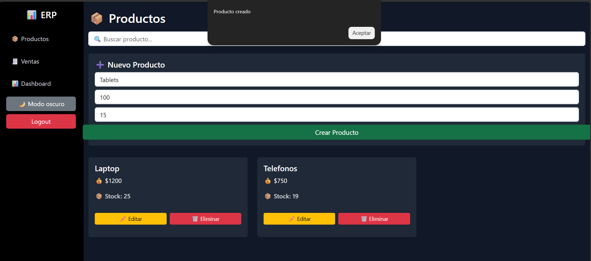
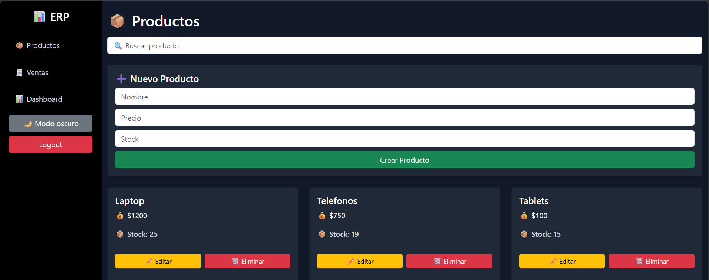
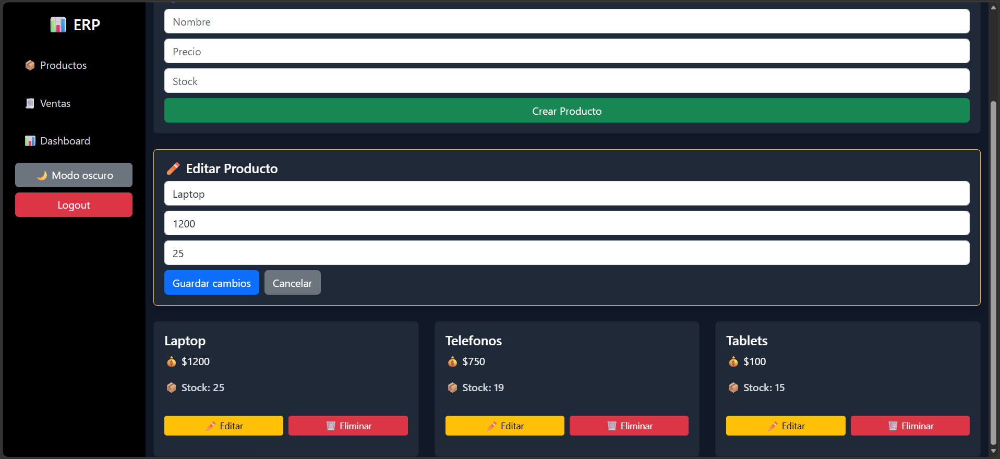
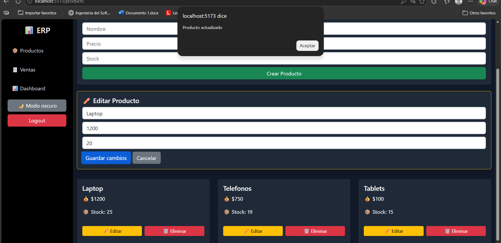
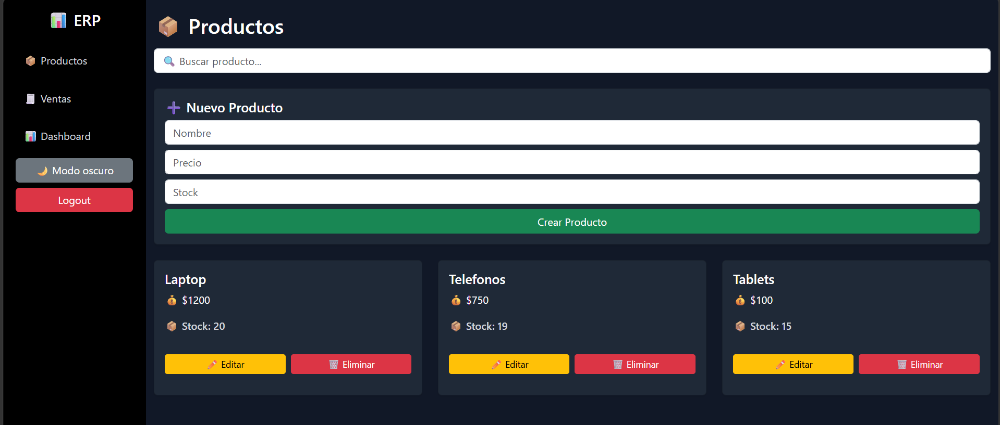
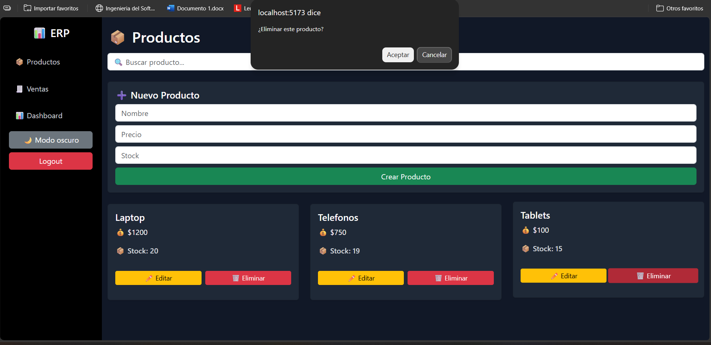
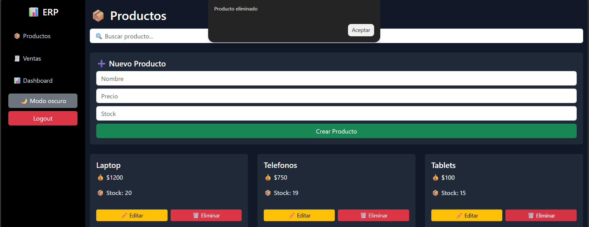
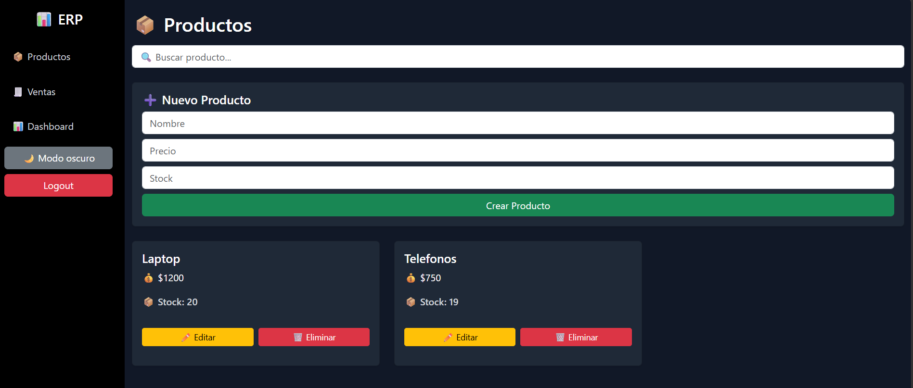
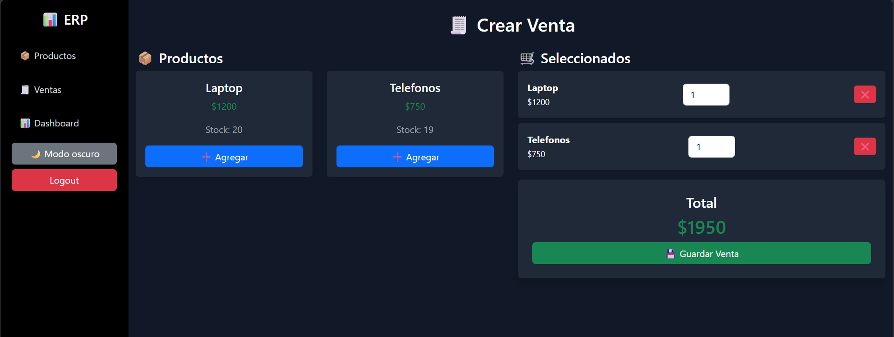
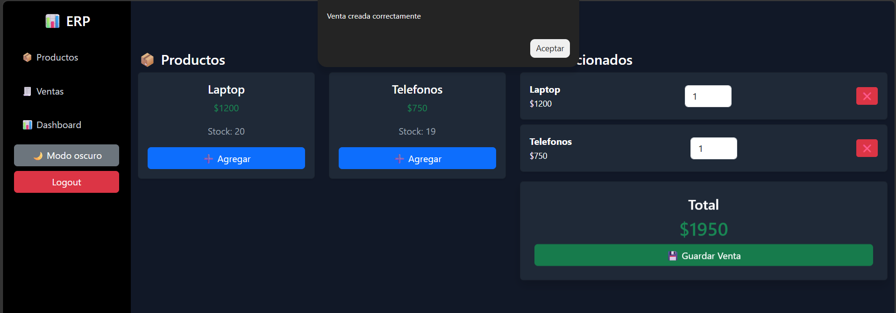
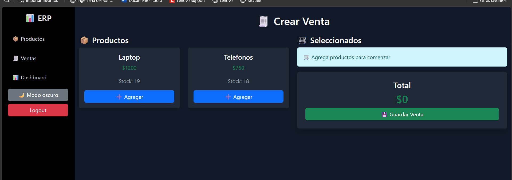
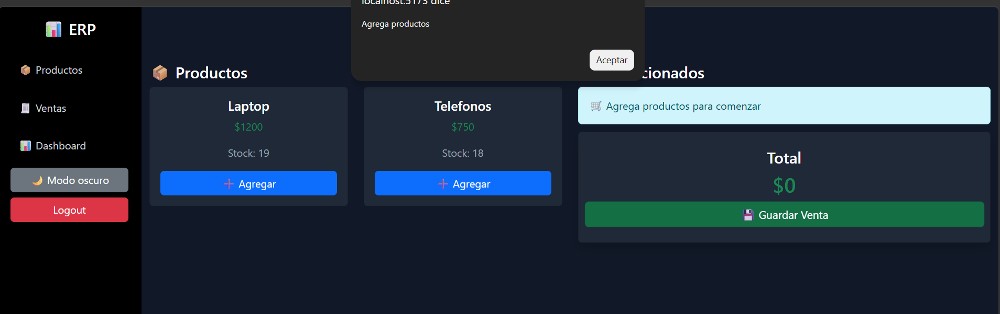
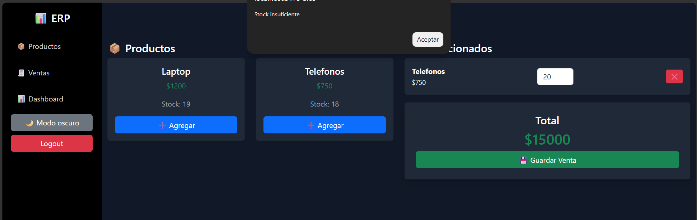
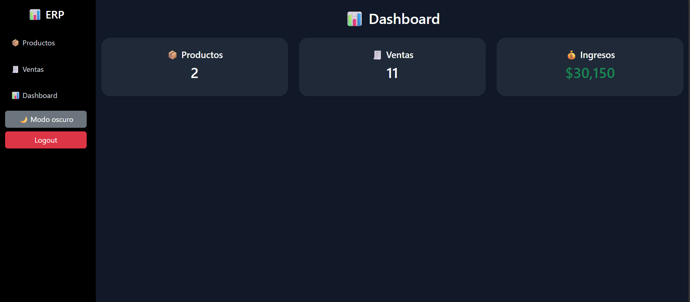
---

## ▶️ Cómo ejecutar

### Backend

dotnet run

### Frontend

npm install
npm start